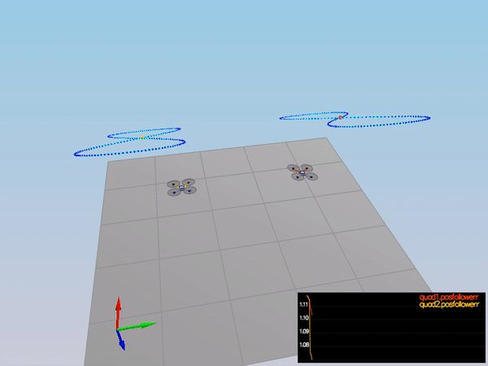

## Project: Control of a 3D Quadrotor

### Writeup / README

<em>
The writeup / README should include a statement
and supporting figures / images that explain how each rubric item was addressed,
and specifically where in the code each step was handled.
</em>

- This WriteUp.md includes the rubric points and explain how I addressed each point.

## Implemented Controller

### Implemented body rate control in C++.

<em>
The controller should be a proportional controller on body rates to commanded moments.
The controller should take into account the moments of inertia of the drone when calculating the commanded moments.
</em>

~~~
    V3F I(Ixx, Iyy, Izz);
    V3F pqrError = pqrCmd - pqr;
    momentCmd = I * kpPQR * pqrError;
~~~

- P controller adjusts p,q,r.
- Commanded moment can be calculated multiply by inertia of the drone.

### Implement roll pitch control in C++.

<em>
The controller should use the acceleration and thrust commands,
in addition to the vehicle attitude to output a body rate command.
The controller should account for the non-linear transformation from local accelerations to body rates.
Note that the drone's mass should be accounted for when calculating the target angles.
</em>

~~~
    if (collThrustCmd > 0) {
        float b_x_c = - accelCmd.x * mass / collThrustCmd;
        float b_y_c = - accelCmd.y * mass / collThrustCmd;

        b_x_c = CONSTRAIN(b_x_c, -maxTiltAngle, maxTiltAngle);
        b_y_c = CONSTRAIN(b_y_c, -maxTiltAngle, maxTiltAngle);

        float b_x_err = b_x_c - R(0, 2);
        float b_x_c_dot = kpBank * b_x_err;

        float b_y_err = b_y_c - R(1, 2);
        float b_y_c_dot = kpBank * b_y_err;

//        p_cmd = ( R[1, 0] * self.Kp_roll  * (b_x_c - R[0, 2]) +
//                - R[0, 0] * self.Kp_pitch * (b_y_c - R[1, 2]) )   / R[2,2]
//        q_cmd = ( R[1, 1] * self.Kp_roll  * (b_x_c - R[0, 2]) +
//                - R[0, 1] * self.Kp_pitch * (b_y_c - R[1, 2]) )   / R[2,2]

        pqrCmd.x = (R(1, 0) * b_x_c_dot - R(0, 0) * b_y_c_dot) / R(2, 2);
        pqrCmd.y = (R(1, 1) * b_x_c_dot - R(0, 1) * b_y_c_dot) / R(2, 2);
    }
    else {
        pqrCmd.x = 0.0;
        pqrCmd.y = 0.0;
    }
~~~

- The roll-pitch controller acounts for non-linear transformation.
- angle value is constrained by maxTiltAngle.

### Implement altitude controller in C++.

<em>
The controller should use both the down position and the down velocity to command thrust.
Ensure that the output value is indeed thrust (the drone's mass needs to be accounted for)
and that the thrust includes the non-linear effects from non-zero roll/pitch angles.
Additionally, the C++ altitude controller should contain
an integrator to handle the weight non-idealities presented in scenario 4.
</em>

~~~~
    float z_err = posZCmd - posZ;
    float vel_err = velZCmd - velZ;
    integratedAltitudeError += z_err * dt;

    float u_1_bar = accelZCmd + kpPosZ * z_err + kpVelZ * vel_err + integratedAltitudeError * KiPosZ;

    float b_z = R(2,2);

    float acc = (u_1_bar - CONST_GRAVITY) / b_z;

    float acc_constrain = CONSTRAIN(acc, -maxAscentRate / dt, maxAscentRate / dt);

    thrust = - mass * acc_constrain;
~~~~

- Altitude controller also consider integrated altitude error to cover the weight non-idealities.
- Output thrust can be calculated by multiplying mass.

### Implement lateral position control in C++.

<em>
The controller should use the local NE position and velocity to generate a commanded local acceleration.
</em>

~~~~
    if ( velCmd.magXY() > maxSpeedXY )
        velCmd = velCmd * maxSpeedXY / velCmd.magXY();

    V3F posErr = posCmd - pos;
    V3F velErr = velCmd - vel;

    float x_dot_dot_c = kpPosXY * posErr.x + kpVelXY * velErr.x + accelCmdFF.x;
    float y_dot_dot_c = kpPosXY * posErr.y + kpVelXY * velErr.y + accelCmdFF.y;

    accelCmd.x = x_dot_dot_c;
    accelCmd.y = y_dot_dot_c;

    if ( accelCmd.magXY() > maxAccelXY )
        accelCmd = accelCmd * maxAccelXY / accelCmd.magXY();
~~~~

- PD controller uses local NE position and velocity.
- Limit the maximum Horizontal velocity and acceleration to MaxSpeedXY and MaxAccelXY.

### Implement yaw control in C++.

<em>
The controller can be a linear/proportional heading controller to yaw rate commands (non-linear transformation not required).
</em>

~~~~
    float yawCmdUnwrapp = fmodf(yawCmd, 2.0 * F_PI);
    float yawErr = yawCmdUnwrapp - yaw;
    if ( yawErr > F_PI )
        yawErr -= 2.0 * F_PI;
    else if ( yawErr < -F_PI )
        yawErr += 2.0 * F_PI;

    yawRateCmd = kpYaw * yawErr;
~~~~

- P controller calculation the commanded Yaw rate.
- Use fmodf to unwrap radian angle measure.

### Implement calculating the motor commands given commanded thrust and moments in C++.

<em>
The thrust and moments should be converted to the appropriate 4 different desired thrust forces for the moments.
Ensure that the dimensions of the drone are properly accounted for when calculating thrust from moments.
</em>

~~~~
    float l = L / sqrt(2);

    float c_bar_x_Kf = collThrustCmd;           //  collThrustCmd = Kf (w^2 + + +)
    float p_bar_x_Kf = momentCmd.x / l;         //  momentCmd.x   = Kf (w^2 - + -) * l
    float q_bar_x_Kf = momentCmd.y / l;         //  momentCmd.y   = Kf (w^2 + - +) * l
    float r_bar_x_Kf = -momentCmd.z / kappa;    //  momentCmd.z   = Km (w^2 - - +)
                                                //      - Km () * Kf/Km

    cmd.desiredThrustsN[0] = (c_bar_x_Kf + p_bar_x_Kf + q_bar_x_Kf + r_bar_x_Kf) / 4.f;
    cmd.desiredThrustsN[1] = (c_bar_x_Kf - p_bar_x_Kf + q_bar_x_Kf - r_bar_x_Kf) / 4.f;
    cmd.desiredThrustsN[2] = (c_bar_x_Kf + p_bar_x_Kf - q_bar_x_Kf - r_bar_x_Kf) / 4.f;
    cmd.desiredThrustsN[3] = (c_bar_x_Kf - p_bar_x_Kf - q_bar_x_Kf + r_bar_x_Kf) / 4.f;
~~~~

- Please see the comment about the calculation.

## Flight Evaluation

### Your C++ controller is successfully able to fly the provided test trajectory and visually passes inspection of the scenarios leading up to the test trajectory.

<em>
Ensure that in each scenario the drone looks stable and performs the required task. Specifically check that the student's controller is able to handle the non-linearities of scenario 4 (all three drones in the scenario should be able to perform the required task with the same control gains used).
</em>

- Scenario 1

Simulation #1 (../config/1_Intro.txt)
PASS: ABS(Quad.PosFollowErr) was less than 0.500000 for at least 0.800000 seconds

- Scenario 2

Simulation #16 (../config/2_AttitudeControl.txt)
PASS: ABS(Quad.Roll) was less than 0.025000 for at least 0.750000 seconds
PASS: ABS(Quad.Omega.X) was less than 2.500000 for at least 0.750000 seconds

- Scenario 3

Simulation #20 (../config/3_PositionControl.txt)
PASS: ABS(Quad1.Pos.X) was less than 0.100000 for at least 1.250000 seconds
PASS: ABS(Quad2.Pos.X) was less than 0.100000 for at least 1.250000 seconds
PASS: ABS(Quad2.Yaw) was less than 0.100000 for at least 1.000000 seconds

- Scenario 4

Simulation #24 (../config/4_Nonidealities.txt)
PASS: ABS(Quad1.PosFollowErr) was less than 0.100000 for at least 1.500000 seconds
PASS: ABS(Quad2.PosFollowErr) was less than 0.100000 for at least 1.500000 seconds
PASS: ABS(Quad3.PosFollowErr) was less than 0.100000 for at least 1.500000 seconds

- Scenario 5

Simulation #27 (../config/5_TrajectoryFollow.txt)
PASS: ABS(Quad2.PosFollowErr) was less than 0.250000 for at least 3.000000 seconds

